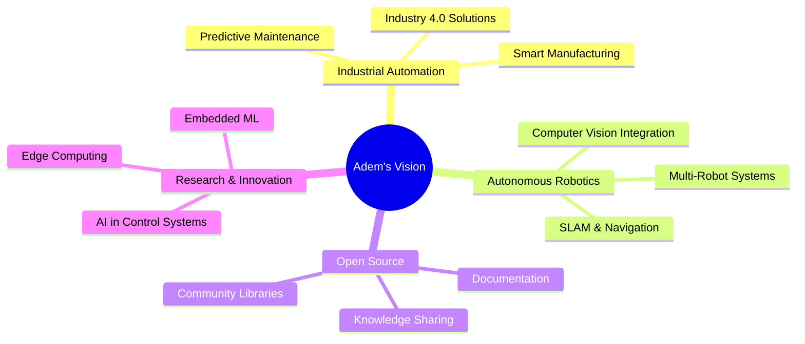

#  Welcome to My Digital Lab

  
  
  
  
  

 

### 👨‍🎓 Academic Excellence
🎓 **Master's Degree** in Automation & Systems  
📍 Sétif, Algeria 🇩🇿  
🔬 Research Focus: Intelligent Control Systems & Autonomous Robotics

### 🚀 What I Do
💡 Design & implement **intelligent automation systems**  
🤖 Build **autonomous robots** with ROS 2 integration  
⚙️ Develop **real-time embedded solutions**  
📊 Apply **advanced control theory** to real-world problems  

### 🎯 Mission
*Engineering tomorrow's automated world, one system at a time*

 

---

## 🛠️ Technology Arsenal

### 💻 Programming Languages

### 🎛️ Automation & Control

### 🔧 Embedded & Hardware

### 🛠️ Tools & Platforms

---

## 🎯 Core Expertise

| 🎛️ **Control Systems** | 🤖 **Robotics** | ⚙️ **Embedded** | 📊 **Signal Processing** |
|:---:|:---:|:---:|:---:|
| PID Controllers | ROS 2 / micro-ROS | Real-Time OS | Kalman Filtering |
| State-Space Design | SLAM & Navigation | Firmware Development | Digital Signal Processing |
| Adaptive Control | Path Planning | Hardware Drivers | Sensor Fusion |
| Optimal Control | Kinematics & Dynamics | DMA & Interrupts | Data Acquisition |
| Fuzzy Logic | Computer Vision | Low-Level Programming | Noise Reduction |

---

## 💡 Featured Projects

### 🏆 Pinned Repositories

<table>
<tr>
<td width="50%">

<h3 align="center">🤖 ROSonicCam</h3>

  

**Multi-directional obstacle detection system for autonomous vehicles**

Real-time embedded system featuring five HC-SR04 ultrasonic sensors with ESP32-WROOM. Implements advanced sensor fusion algorithms for 360° environmental awareness in robotics and drone applications.

`ESP32` `C++` `Sensor Fusion` `Real-Time` `Autonomous Systems`

</td>
<td width="50%">

<h3 align="center">🎛️ Pico Servo Library</h3>

**Industrial-grade servo control for precision automation**

High-performance library for Raspberry Pi Pico with hardware PWM, smooth trajectory generation, and microsecond-level precision. Designed for robotic arms and automated manufacturing.

`Raspberry Pi Pico` `C` `PWM` `Motion Control` `Hardware Abstraction`

</td>
</tr>

<tr>
<td width="50%">

<h3 align="center">📡 micro-ROS Ultrasonic Driver</h3>

**Professional ROS 2 sensor integration with Kalman filtering**

Production-ready driver publishing raw and filtered ultrasonic data to ROS 2 topics. Demonstrates signal processing, real-time communication, and distributed systems architecture.

`micro-ROS` `ROS 2` `Kalman Filter` `C++` `Signal Processing`

</td>
<td width="50%">

<h3 align="center">⚡ L293D Motor Driver</h3>

**Complete H-bridge motor control solution**

Modular driver for bidirectional DC motor control with speed regulation. Features clean API, PWM speed control, and hardware abstraction for mobile robotics.

`PlatformIO` `C` `Motor Control` `PWM` `Hardware Driver`

</td>
</tr>

<tr>
<td colspan="2">

<h3 align="center">📊 Multithreaded Sensor Logger</h3>

**Industrial data acquisition with concurrent processing**

Multi-threaded sensor monitoring system with thread-safe data logging. Simulates temperature, humidity, and light sensors with CSV export for SCADA integration and data analysis.

`C` `Multithreading` `Data Acquisition` `POSIX Threads` `Industrial IoT`

</td>
</tr>
</table>

---

## 📊 GitHub Analytics

  
  
  
  
  
  

---

## 🎓 Academic & Research Background

| 🎯 **Specialization** | 📚 **Core Knowledge** | 🔬 **Research Interests** |
|:---:|:---:|:---:|
| Automation & Control | Classical & Modern Control Theory | Autonomous Mobile Robots |
| Embedded Systems | Digital Signal Processing | Intelligent Sensor Networks |
| Industrial Automation | Robotics & Mechatronics | Adaptive Control Systems |
| Systems Engineering | Real-Time Systems | Industrial IoT & Industry 4.0 |

---

## 🌟 Current Focus & Goals

---

## 📬 Let's Connect & Collaborate

### 🤝 Open to collaboration on automation, robotics, and embedded systems projects!

### 💬 Ask me about: 
**Control Systems** • **ROS 2** • **Embedded C/C++** • **Industrial Automation** • **Sensor Fusion** • **Real-Time Systems**

---

---

  
  ### ⚡ *"Transforming theoretical knowledge into intelligent systems that shape the future"*
  
  
  
  

